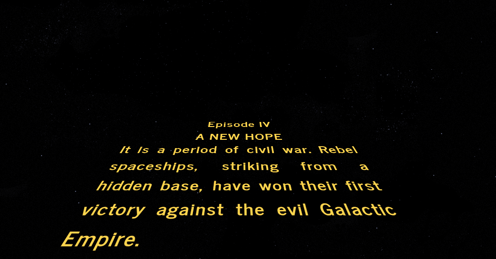

  

# Star Wars Intro Creator

Create your own Star Wars movie opening.  
Fill the inputs with any text and hit Play.  
You can share the URL generated and anyone can see your intro.  
Access: [https://brorlandi.github.io/StarWarsIntroCreator/](https://brorlandi.github.io/StarWarsIntroCreator/)

## Credits
Build on top of the [work by Tim Pietrusky](http://timpietrusky.com/star-wars-opening-crawl-from-1977)  
By [Bruno Orlandi](https://github.com/BrOrlandi) and [Nihey Takizawa](https://github.com/nihey)

## Screenshots

